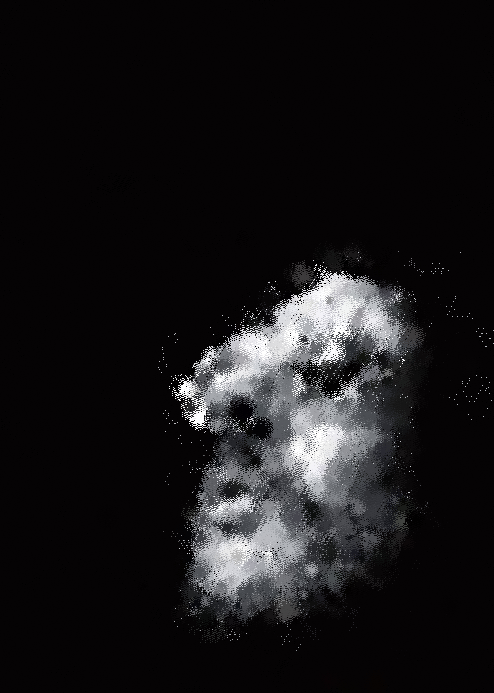
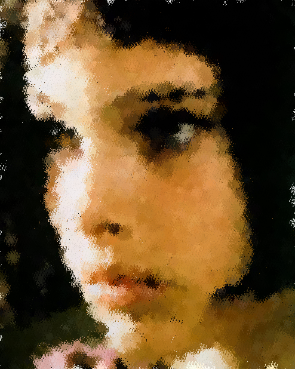
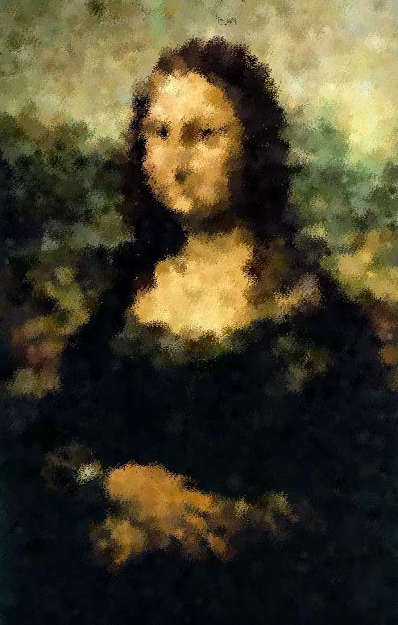
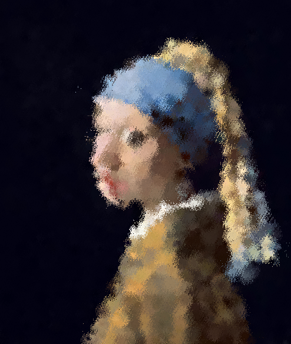

# Taichi-Procedure Painting

## 背景简介
模仿绘画的过程生成任意图片

## 成功效果展示









## 整体结构（Optional）
```
-LICENSE
-|data
-README.MD
-xxx.py
```

## 运行方式
将Procedure_painting.py与输入图片放在同一文件夹中,修改.py中图片的文件名，在taichi环境中运行即可。

