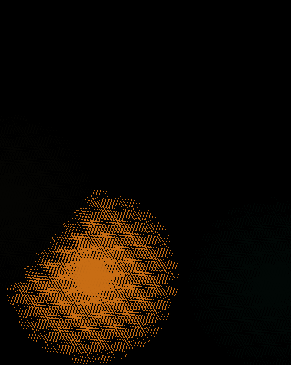

# Taichi-Procedural Painting

## 背景简介
模仿绘画的过程生成任意图片

## 成功效果展示

 
Procedural Leon using CIRCULAR stroke
 
Procedural Leon using CUBIC stroke

 
Procedutal Jean Genie using CIRCULAR stroke
 
Procedutal Jean Genie using CUBIC stroke

 
Procedural Mona Lisa using CIRCULAR strok
 
Procedural Mona Lisa using CUBIC strok

 
Procedural Meisje met de parel using CIRCULAR stroke
 
Procedural Meisje met de parel using CUBIC stroke
